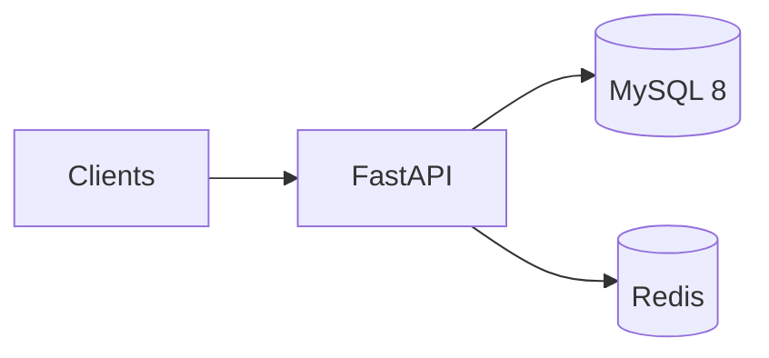

# System Architecture & Scaling (100k+ Tasks)

This document describes how the Intelligent Task Management System is structured today, how it behaves under larger data volumes (on the order of **100,000+ tasks**), and sensible evolution paths. It maps concepts to code paths in this repository.

---

## 1. Goals & assumptions

| Item | Assumption |
|------|------------|
| **Data volume** | ≥ 100k rows in `tasks`; dependency edges grow with product usage (typically sub-linear to linear in tasks). |
| **Traffic** | Read-heavy UI patterns: single-task fetch, filtered lists, dependency lists; writes less frequent but latency-sensitive when dependency rules run. |
| **Deployment** | Single-region, monolithic API process(es) behind a reverse proxy; MySQL as source of truth; Redis for optional hot-path cache. |

Non-goals for the current codebase: multi-region active-active, sharded MySQL, or full observability stacks (only lightweight timing headers exist).

---

## 2. Logical architecture

- **FastAPI** (`app/main.py`, `app/api/routes/task.py`): HTTP, validation, OpenAPI.  
- **CRUD / domain** (`app/crud/task.py`): queries, dependency cycle checks, completion guards, cache read-through and invalidation.  
- **MySQL**: durable state for `tasks` and `task_dependencies` (`app/models/task.py`, Alembic under `alembic/versions/`).  
- **Redis** (`app/core/cache.py`): cache for `GET /tasks/{id}` and `GET /tasks/{id}/dependencies` keys `task:{id}` and `task_deps:{id}`.

---

## 3. Data model (summary)

### `tasks`

- Core fields: `title`, `description`, `status`, `priority`, `tags` (JSON array of strings), timestamps.  
- **List workload:** filtered/sorted pagination via `GET /tasks` — performance depends on **composite indexing** aligned with filter + sort. Migration `24077f4738ab` adds `idx_tasks_status_priority_created_at` for typical list patterns.

### `task_dependencies`

- Directed edge: **`task_id` depends on `depends_on_task_id`** (prerequisite must be `completed` before `task_id` can be completed).  
- Constraints: unique `(task_id, depends_on_task_id)`, check `task_id != depends_on_task_id`, FKs with `ON DELETE CASCADE` on the dependent side and `RESTRICT` on the prerequisite side (see model).  
- **Indexes:** `task_id` and `depends_on_task_id` (migration `24077f4738ab`) to accelerate “who do I depend on?” and reverse lookups used in cycle detection BFS.

---

## 4. Scaling considerations (100k+ tasks)

### 4.1 List queries (`GET /tasks`)

- **Risk:** Full table scans or poor index merge when filters and `ORDER BY` disagree with available indexes.  
- **Mitigation (implemented):** Composite index on `(status, priority, created_at)` supports common filter + sort combinations.  
- **Future:** For very large **offsets**, classic `OFFSET` pagination degrades; migrate to **keyset (cursor) pagination** (`WHERE (created_at, id) < (?, ?) ORDER BY ... LIMIT`) to keep latency stable.

### 4.2 Single-task reads (`GET /tasks/{id}`)

- **Risk:** Repeated identical reads under load hit MySQL.  
- **Mitigation (implemented):** Redis cache with invalidation on task update/delete.  
- **Future:** Stale reads under replication lag if you introduce MySQL read replicas — use **cache TTL** + **write-through** discipline, or route reads to primary for strongly consistent screens.

### 4.3 Dependency operations

- **Insert:** BFS in `_would_create_cycle` touches the dependency graph; cost scales with **reachable nodes/edges**, not only total task count.  
- **Complete:** `assert_can_complete_task` batches prerequisite status checks — good for many direct dependencies.  
- **Future:** For deep graphs, bound BFS depth, move cycle checks to a **single recursive SQL CTE** (MySQL 8), or maintain a materialized cycle-free invariant via background validation.

### 4.4 Connection management

- **Risk:** Connection storms or idle disconnects from MySQL.  
- **Mitigation (implemented):** SQLAlchemy pool parameters in `app/core/db.py` (`pool_size`, `max_overflow`, `pool_recycle`, `pool_timeout`).  
- **Future:** Tune from measured concurrency; consider **async** I/O stack if sustained high fan-out.

### 4.5 Multi-tenancy & security (pre-scale requirement)

- Current API is **public** (no per-user partition). At scale with multiple tenants, every query must include **`owner_id` / `tenant_id`** and be backed by composite indexes starting with that key — otherwise row counts per tenant do not protect you from cross-tenant scans.

---

## 5. Caching strategy (consistency)

| Key pattern | Populated on | Invalidated on |
|-------------|--------------|-------------------|
| `task:{id}` | Cache miss after DB read | Task update, task delete |
| `task_deps:{id}` | Cache miss after DB read | Dependency add/remove, task update/delete |

**Trade-off:** Short windows of inconsistency are bounded by TTL (see `RedisCache.set` defaults in code). For stricter consistency, shorten TTL or disable cache for affected routes.

---

## 6. Observability & operations

- **Today:** `X-Process-Time` header and console logging middleware (`app/main.py`); `benchmark.py` for coarse load experiments.  
- **Recommended next:** structured JSON logs, request IDs, basic metrics (p50/p95 latency per route), slow-query log on MySQL, Alembic migration checks in CI.

---

## 7. Failure modes & mitigations

| Failure | Effect | Mitigation |
|---------|--------|------------|
| MySQL down | All persistence fails | Health checks, retries with backoff, operator alerts |
| Redis down | Cached paths may error | Connection handling / circuit breaker; optional cache bypass |
| Hot row on `tasks` | Contention on ultra-hot tasks | Rate limits, queue writes, or split “metadata” vs “content” |

---

## 8. Evolution roadmap (prioritized)

1. **Authentication & authorization** — JWT or session; `owner_id` on `tasks` + scoped queries.  
2. **Cursor-based pagination** for `GET /tasks` at large offsets.  
3. **Full-text search** (MySQL `FULLTEXT` or sidecar OpenSearch).  
4. **Read replicas** for reporting/list traffic; cache invalidation strategy updated accordingly.  
5. **Async jobs** for notifications, analytics, or heavy graph recompute.

---

## 9. Code map (quick reference)

| Concern | Location |
|---------|----------|
| HTTP routes | `app/api/routes/task.py` |
| Business rules & SQL | `app/crud/task.py` |
| ORM models | `app/models/task.py` |
| API schemas | `app/schemas/task.py` |
| DB engine / pool | `app/core/db.py` |
| Redis wrapper | `app/core/cache.py` |
| Settings | `app/core/config.py` |
| Migrations | `alembic/versions/` |

---

## Document history

- Initial version: system design & 100k-scale considerations aligned with the repository layout at authoring time.
